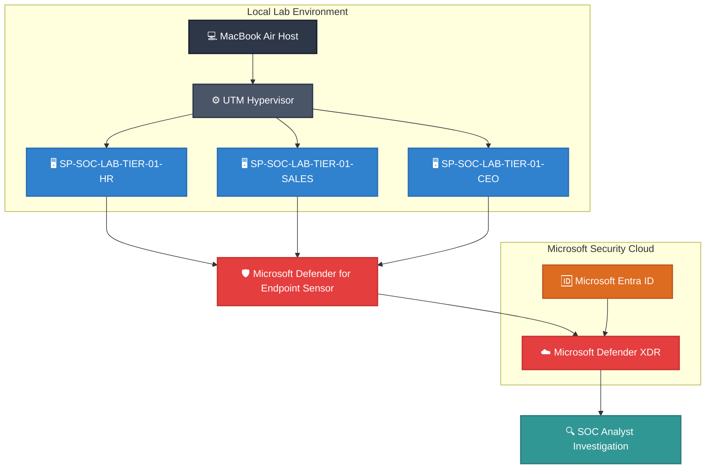

# 🛡️ Enterprise-Microsoft-Defender-XDR-Lab

## 📌 Project Overview

This project demonstrates the design, deployment, and operation of a simulated enterprise Security Operations Center (SOC) using **Microsoft Defender XDR**. 

The objective of this lab is to gain practical, hands-on experience with enterprise endpoint security, Microsoft Defender for Endpoint (MDE), incident investigation, and SOC workflows that closely resemble a live production environment. Rather than focusing on isolated demonstrations, this lab simulates a small, functional organization featuring multiple departments, business users, and Windows endpoints.

---

## 🏗️ Architecture Diagram 

---





## 📂 Repository Structure

```text
Enterprise-Microsoft-Defender-XDR-Lab
│
├── README.md
│
├── investigations
│   │
│   ├── INC-001-HR-PowerShell-Test
│   │      ├── README.md
│   │      └── screenshots
│   │
│   └── INC-002-Sales-PowerShell
│          ├── README.md
│          └── screenshots
│
├── kql
│      └── (coming later)
│
├── scripts
│      └── (coming later)
│
└── architecture
       └── diagrams
```
---


## 🎯 Lab Objectives
* 🏗️ **Build an Infrastructure:** Provision a Microsoft 365 enterprise tenant from scratch.
* 👥 **Identity Management:** Configure Microsoft Entra ID users, groups, and administrative roles.
* 🛡️ **Security Deployment:** Deploy and tune Microsoft Defender XDR across the enterprise.
* 💻 **Endpoint Onboarding:** Onboard multiple Windows endpoints via automated and manual methods.
* 🏢 **Simulate Business Operations:** Model realistic enterprise users and functional departments.
* 🚨 **Generate Threat Telemetry:** Execute simulation scripts to trigger realistic security alerts.
* 🔍 **Triage & Investigate:** Analyze cross-domain incidents using the Microsoft Defender Portal.
* 📝 **Incident Documentation:** Document findings and timelines using professional SOC reporting templates.
* ⚡ **Advanced Threat Hunting:** Author and execute KQL (Kusto Query Language) queries to hunt for IOCs.

---

## 🏢 Enterprise Environment Map

| Department | User Name | Device Hostname | Status |
| :--- | :--- | :--- | :--- |
| **Human Resources** | Emma Wilson | `SP-SOC-LAB-TIER-01-HR` | 🟢 Active / Onboarded |
| **Sales** | Anna Becker | `SP-SOC-LAB-TIER-01-SALES` | 🟢 Active / Onboarded |
| **CEO | Michael Weber | `SP-SOC-LAB-TIER-01-CEO` | 🟢 Active / Onboarded |
| **Finance** | John Schneider | `FIN-LAPTOP-01` | ⏳ Planned |
| **Executive** | Michael Weber | `EXEC-LAPTOP-01` | ⏳ Planned |
| **IT Administration** | Alex Müller | `MGMT-WORKSTATION` | ⏳ Planned |
| **Security Operations** | Sachin Patil | `SOC-ANALYST-01` | 💻 Defender Portal Access |

---

## 🛠️ Technologies Used
* **XDR:** Microsoft Defender XDR Portal
* **EDR/EPP:** Microsoft Defender for Endpoint (MDE)
* **Identity & Access:** Microsoft Entra ID (Azure AD)
* **Cloud Suite:** Microsoft 365 Enterprise
* **Operating Systems:** Windows 11 Enterprise
* **Hypervisor:** UTM Virtual Machines (Apple Silicon Host)
* **Automation:** PowerShell
* **Query Language:** KQL (Kusto Query Language)

---

## 🧠 Skills Demonstrated

### ✅ Completed and Validated

* 📥 **Endpoint Onboarding:** Manually onboarded multiple Windows 11 endpoints using the Microsoft Defender for Endpoint local onboarding package.
* 👥 **Least-Privilege User Configuration:** Created standard local business-user accounts and retained separate administrative credentials.
* 🚦 **Alert Triage:** Reviewed severity, affected users, devices, command lines, and alert status.
* 🌿 **Process Tree Analysis:** Examined parent-child relationships such as `cmd.exe → powershell.exe`.
* 🔐 **File Trust Analysis:** Reviewed executable paths, Microsoft digital signatures, hashes, and VirusTotal detection ratios.
* 📝 **Incident Documentation:** Recorded investigation findings and resolved a controlled alert as security testing.
* 🧩 **Onboarding Troubleshooting:** Diagnosed insufficient privileges and successfully reran onboarding from an elevated command prompt.

### 🚧 Planned

* 🕒 Device timeline and event-sequence analysis
* ⚔️ Controlled simulations involving Office documents and LOLBins
* 📊 Advanced Hunting using KQL
* 🌐 Network IOC and external-IP investigation
* 🔁 Persistence and scheduled-task analysis
* ☁️ Microsoft Sentinel integration


---

## ⚔️ MITRE ATT&CK Coverage

The following MITRE ATT&CK techniques were validated through controlled simulations and Microsoft Defender XDR investigations.

| Status | Technique | Validation |
| :---: | :--- | :--- |
| ✅ | **T1059.001 – PowerShell** | Suspicious PowerShell execution and command-line activity investigated in Defender XDR |
| ✅ | **T1566 – Phishing** | Credential-phishing simulation, user interaction, alert triage, and incident investigation |
| ✅ | **T1087 – Account Discovery** | Account discovery activity observed during endpoint investigation |
| ✅ | **T1033 – System Owner/User Discovery** | User-context discovery using `whoami` |
| ✅ | **T1016 – System Network Configuration Discovery** | Network configuration discovery activity investigated |
| 🚧 | **T1218 – Signed Binary Proxy Execution** | Planned LOLBin simulation using trusted Windows binaries |
| 🚧 | **T1105 – Ingress Tool Transfer** | Planned controlled file-transfer investigation |
| 🚧 | **T1053.005 – Scheduled Task/Job** | Planned persistence simulation |
| 🚧 | **T1562.001 – Impair Defenses** | Planned Defender-tampering investigation |

> MITRE ATT&CK mappings are documented only when the corresponding behavior has been generated, observed, and investigated in the lab.

---

## 📈 Current Project Progress

- [x] Create and configure Microsoft 365 enterprise tenant
- [x] Deploy and configure Microsoft Defender XDR
- [x] Provision Microsoft Entra ID users and security groups
- [x] Deploy HR, Sales, and CEO test endpoints
- [x] Onboard lab endpoints to Microsoft Defender for Endpoint
- [x] Configure SOC incident investigation and triage workflow
- [x] Execute controlled phishing and endpoint attack simulations
- [x] Investigate Defender alerts and correlated incidents
- [x] Perform KQL-based threat hunting and telemetry validation
- [x] Document Tier-1 investigation and escalation workflows
- [x] Document complete incident investigation lifecycles

---

## 🔐 Security and Privacy Notice

All activity was performed in an isolated personal lab tenant using controlled test endpoints.

Sensitive information is excluded or redacted, including:

- Tenant and subscription identifiers
- Authentication details and passwords
- Device identifiers
- Public IP addresses
- Personal contact information
- Unredacted administrator account information

No production systems or third-party environments were targeted.
