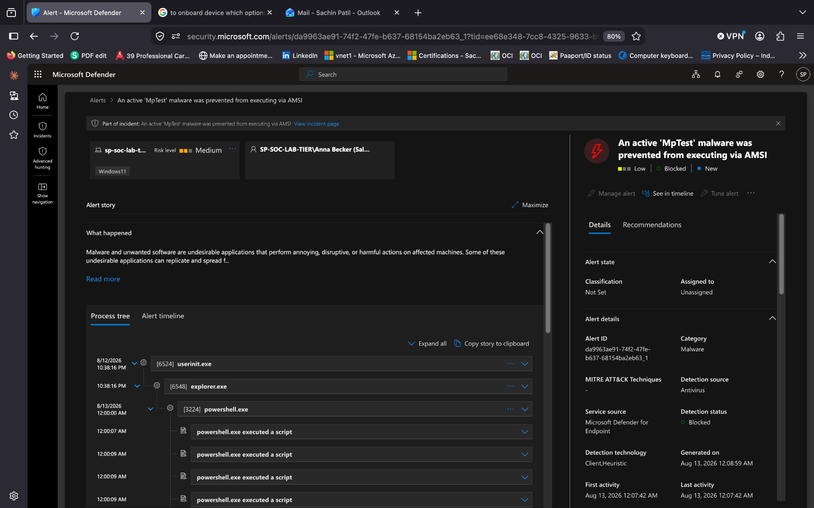

# 🚨 INC-002 — Malware Prevented via AMSI

> **Microsoft Defender XDR | Tier-1 SOC Investigation | Sales**

## 📋 Incident Summary

| Field            | Finding                                                   |
| ---------------- | --------------------------------------------------------- |
| 🚨 Alert         | An active 'MpTest' malware was prevented from executing via AMSI |
| ⚠️ Severity      | Low                                                       |
| 👤 User          | Anna Becker (Sales)                                       |
| 💻 Endpoint      | `SP-SOC-LAB-TIER-01`                                      |
| 🛡️ Detection    | Microsoft Defender for Endpoint                           |
| 🔎 Investigation | Alert + Process Context + Timeline + KQL + Scope          |
| ✅ Decision      | True Positive — Authorized Security Test / Blocked        |

---

## 🎯 Incident Overview

Microsoft Defender generated an alert after AMSI detected malicious test content during PowerShell script execution.

Defender prevented the detected content from executing, and the activity was investigated to confirm the affected user, process, remediation status, and scope.

### 📸 Evidence 01 — Defender Alert



**Analyst observation:**
The alert identified the affected endpoint and user and confirmed that Defender blocked the detected activity.

---

## 🌳 Process & Detection Analysis

The alert timeline identified PowerShell as the initiating process and showed the script associated with the detection:

```text
powershell.exe
   │
   └── AMSI_PoSh_script.ps1
          │
          └── Virus:Win32/MpTest!amsi
```

The observed command line included:

```text
powershell.exe -ExecutionPolicy Bypass -File "C:\Users\Anna Becker (Sales)\Desktop\AMSI_PoSh_script.ps1"
```

### 📸 Evidence 02 — Alert Timeline & Detection


**Analyst observation:**
The timeline confirmed that the PowerShell script triggered the AMSI detection and that Defender successfully prevented execution.

---

## 🔬 Advanced Hunting Validation

Microsoft Defender Advanced Hunting was used to validate the PowerShell execution using endpoint telemetry.

The investigation confirmed PowerShell activity associated with:

```text
AMSI_PoSh_script.ps1
```

on:

```text
SP-SOC-LAB-TIER-01
Anna Becker (Sales)
```

### 📸 Evidence 03 — Advanced Hunting


**Analyst observation:**
Endpoint telemetry confirmed the PowerShell activity associated with the script on the affected device and user account.

---

## 🌍 Scope Investigation

A focused scope check was performed to determine whether the same script activity appeared on additional endpoints.

```kql
DeviceProcessEvents
| where Timestamp > ago(7d)
| where ProcessCommandLine contains "AMSI_PoSh_script.ps1"
| summarize
    EventCount=count(),
    FirstSeen=min(Timestamp),
    LastSeen=max(Timestamp)
    by DeviceName, AccountName
| order by EventCount desc
```

### 📸 Evidence 04 — Scope Analysis


The hunt identified the activity only on:

| Endpoint             | User                | Events |
| -------------------- | ------------------- | -----: |
| `SP-SOC-LAB-TIER-01` | Anna Becker (Sales) |      2 |

No additional affected endpoints were identified within the searched Defender telemetry.

---

## 🧠 Investigation Decision

The detection was validated as a **True Positive** because Microsoft Defender correctly identified and blocked the test malware behavior through AMSI.

Investigation confirmed:

- PowerShell initiated the detected activity
- AMSI identified `Virus:Win32/MpTest!amsi`
- Defender successfully blocked execution
- the activity was associated with the expected test script
- scope analysis identified no additional affected endpoints

The activity originated from an **authorized security validation exercise** and did not require containment or escalation.

---

## ⚔️ MITRE ATT&CK Mapping

| Technique   | Description |
| ----------- | ----------- |
| `T1059.001` | PowerShell  |

> MITRE ATT&CK techniques describe observed behavior; they do not by themselves prove malicious intent.

---

## ✅ Final Disposition

**Classification:** True Positive — Authorized Security Test  
**Detection Result:** Successfully Blocked  
**Escalation:** Not Required  
**Containment:** Not Required  
**Status:** Resolved

### Reason for Resolution

Microsoft Defender correctly detected and blocked the test malware behavior through AMSI. Endpoint telemetry validated the PowerShell execution, and scope analysis identified no additional affected endpoints within the available dataset.

---

## 🎓 SOC Skills Demonstrated

`Alert Triage` • `Process Analysis` • `AMSI Detection` • `PowerShell Analysis` • `KQL` • `Advanced Hunting` • `Scope Analysis` • `Incident Disposition`

---

### 🛡️ Analyst Takeaway

> **A successful prevention still requires validation: confirm what triggered the detection, verify the security control acted successfully, check the scope, and document the final disposition.**
